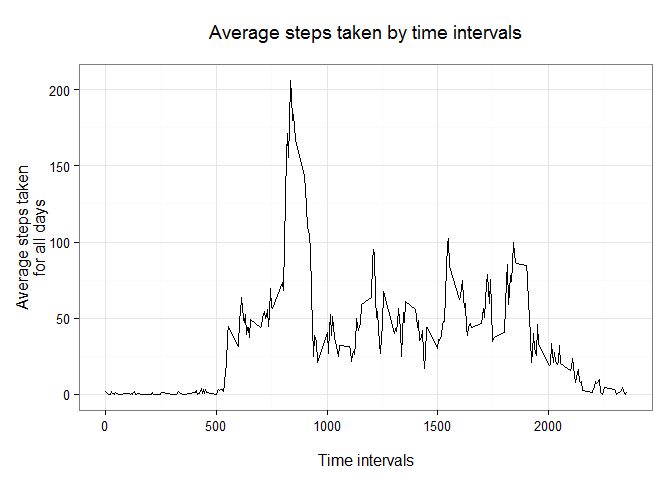
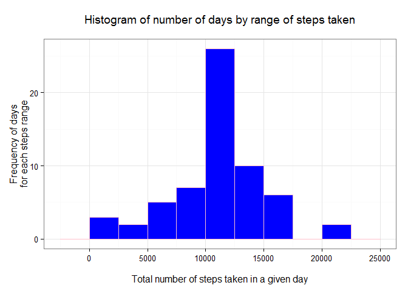
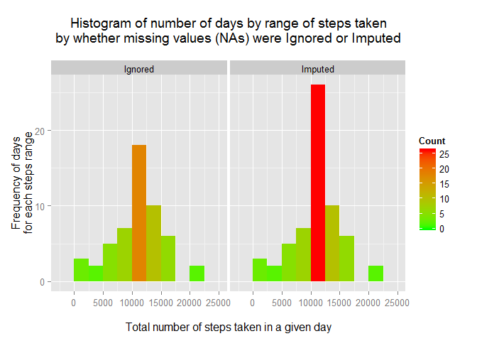
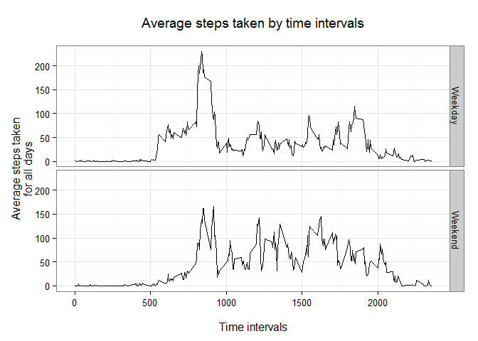

# Reproductible Research Course - Project 1
Wednesday, July 15, 2015  


This project answers questions from Peer Assessment asignment #1, of the reproductible Research course on Coursera.


<hr>

## 1. Loading and preprocessing the data

<hr>

#### 1.1 Load the data (i.e. read.csv()) and process/transform the data (if necessary) into a format suitable for your analysis

The code below will load all of the libraries required by this project, handle some global formatting issues and finally load the dataset.


```r
## Setting up the library and folder used in the assignment
library(dplyr)
library(ggplot2)
library(xtable)

## numbers >= 10^5 will be denoted in scientific notation and rounded to 2 digits
options(scipen = 1, digits = 2)

## Reads the file in data frames that can be used by dplyr
activities <- tbl_df(read.csv("activity.csv"))
```

<hr>

## 2. What is mean total number of steps taken per day?

<hr>
For this part of the assignment, you can ignore the missing values in the dataset.

<hr>

#### 2.1 Calculate the total number of steps taken per day


```r
# Creates the summary by date, and filters out the "NA"s
SPD <- summarise(group_by(filter(activities,steps != "NA"),date),Total_Steps=sum(steps))

#Use the xtable library to create an html table with all the results
print(xtable(SPD, caption="<b>Total</b> number of steps taken per day"), type="html", caption.placement="top")
```

<!-- html table generated in R 3.1.3 by xtable 1.7-4 package -->
<!-- Fri Jul 17 19:56:20 2015 -->
<table border=1>
<caption align="top"> <b>Total</b> number of steps taken per day </caption>
<tr> <th>  </th> <th> date </th> <th> Total_Steps </th>  </tr>
  <tr> <td align="right"> 1 </td> <td> 2012-10-02 </td> <td align="right"> 126 </td> </tr>
  <tr> <td align="right"> 2 </td> <td> 2012-10-03 </td> <td align="right"> 11352 </td> </tr>
  <tr> <td align="right"> 3 </td> <td> 2012-10-04 </td> <td align="right"> 12116 </td> </tr>
  <tr> <td align="right"> 4 </td> <td> 2012-10-05 </td> <td align="right"> 13294 </td> </tr>
  <tr> <td align="right"> 5 </td> <td> 2012-10-06 </td> <td align="right"> 15420 </td> </tr>
  <tr> <td align="right"> 6 </td> <td> 2012-10-07 </td> <td align="right"> 11015 </td> </tr>
  <tr> <td align="right"> 7 </td> <td> 2012-10-09 </td> <td align="right"> 12811 </td> </tr>
  <tr> <td align="right"> 8 </td> <td> 2012-10-10 </td> <td align="right"> 9900 </td> </tr>
  <tr> <td align="right"> 9 </td> <td> 2012-10-11 </td> <td align="right"> 10304 </td> </tr>
  <tr> <td align="right"> 10 </td> <td> 2012-10-12 </td> <td align="right"> 17382 </td> </tr>
  <tr> <td align="right"> 11 </td> <td> 2012-10-13 </td> <td align="right"> 12426 </td> </tr>
  <tr> <td align="right"> 12 </td> <td> 2012-10-14 </td> <td align="right"> 15098 </td> </tr>
  <tr> <td align="right"> 13 </td> <td> 2012-10-15 </td> <td align="right"> 10139 </td> </tr>
  <tr> <td align="right"> 14 </td> <td> 2012-10-16 </td> <td align="right"> 15084 </td> </tr>
  <tr> <td align="right"> 15 </td> <td> 2012-10-17 </td> <td align="right"> 13452 </td> </tr>
  <tr> <td align="right"> 16 </td> <td> 2012-10-18 </td> <td align="right"> 10056 </td> </tr>
  <tr> <td align="right"> 17 </td> <td> 2012-10-19 </td> <td align="right"> 11829 </td> </tr>
  <tr> <td align="right"> 18 </td> <td> 2012-10-20 </td> <td align="right"> 10395 </td> </tr>
  <tr> <td align="right"> 19 </td> <td> 2012-10-21 </td> <td align="right"> 8821 </td> </tr>
  <tr> <td align="right"> 20 </td> <td> 2012-10-22 </td> <td align="right"> 13460 </td> </tr>
  <tr> <td align="right"> 21 </td> <td> 2012-10-23 </td> <td align="right"> 8918 </td> </tr>
  <tr> <td align="right"> 22 </td> <td> 2012-10-24 </td> <td align="right"> 8355 </td> </tr>
  <tr> <td align="right"> 23 </td> <td> 2012-10-25 </td> <td align="right"> 2492 </td> </tr>
  <tr> <td align="right"> 24 </td> <td> 2012-10-26 </td> <td align="right"> 6778 </td> </tr>
  <tr> <td align="right"> 25 </td> <td> 2012-10-27 </td> <td align="right"> 10119 </td> </tr>
  <tr> <td align="right"> 26 </td> <td> 2012-10-28 </td> <td align="right"> 11458 </td> </tr>
  <tr> <td align="right"> 27 </td> <td> 2012-10-29 </td> <td align="right"> 5018 </td> </tr>
  <tr> <td align="right"> 28 </td> <td> 2012-10-30 </td> <td align="right"> 9819 </td> </tr>
  <tr> <td align="right"> 29 </td> <td> 2012-10-31 </td> <td align="right"> 15414 </td> </tr>
  <tr> <td align="right"> 30 </td> <td> 2012-11-02 </td> <td align="right"> 10600 </td> </tr>
  <tr> <td align="right"> 31 </td> <td> 2012-11-03 </td> <td align="right"> 10571 </td> </tr>
  <tr> <td align="right"> 32 </td> <td> 2012-11-05 </td> <td align="right"> 10439 </td> </tr>
  <tr> <td align="right"> 33 </td> <td> 2012-11-06 </td> <td align="right"> 8334 </td> </tr>
  <tr> <td align="right"> 34 </td> <td> 2012-11-07 </td> <td align="right"> 12883 </td> </tr>
  <tr> <td align="right"> 35 </td> <td> 2012-11-08 </td> <td align="right"> 3219 </td> </tr>
  <tr> <td align="right"> 36 </td> <td> 2012-11-11 </td> <td align="right"> 12608 </td> </tr>
  <tr> <td align="right"> 37 </td> <td> 2012-11-12 </td> <td align="right"> 10765 </td> </tr>
  <tr> <td align="right"> 38 </td> <td> 2012-11-13 </td> <td align="right"> 7336 </td> </tr>
  <tr> <td align="right"> 39 </td> <td> 2012-11-15 </td> <td align="right">  41 </td> </tr>
  <tr> <td align="right"> 40 </td> <td> 2012-11-16 </td> <td align="right"> 5441 </td> </tr>
  <tr> <td align="right"> 41 </td> <td> 2012-11-17 </td> <td align="right"> 14339 </td> </tr>
  <tr> <td align="right"> 42 </td> <td> 2012-11-18 </td> <td align="right"> 15110 </td> </tr>
  <tr> <td align="right"> 43 </td> <td> 2012-11-19 </td> <td align="right"> 8841 </td> </tr>
  <tr> <td align="right"> 44 </td> <td> 2012-11-20 </td> <td align="right"> 4472 </td> </tr>
  <tr> <td align="right"> 45 </td> <td> 2012-11-21 </td> <td align="right"> 12787 </td> </tr>
  <tr> <td align="right"> 46 </td> <td> 2012-11-22 </td> <td align="right"> 20427 </td> </tr>
  <tr> <td align="right"> 47 </td> <td> 2012-11-23 </td> <td align="right"> 21194 </td> </tr>
  <tr> <td align="right"> 48 </td> <td> 2012-11-24 </td> <td align="right"> 14478 </td> </tr>
  <tr> <td align="right"> 49 </td> <td> 2012-11-25 </td> <td align="right"> 11834 </td> </tr>
  <tr> <td align="right"> 50 </td> <td> 2012-11-26 </td> <td align="right"> 11162 </td> </tr>
  <tr> <td align="right"> 51 </td> <td> 2012-11-27 </td> <td align="right"> 13646 </td> </tr>
  <tr> <td align="right"> 52 </td> <td> 2012-11-28 </td> <td align="right"> 10183 </td> </tr>
  <tr> <td align="right"> 53 </td> <td> 2012-11-29 </td> <td align="right"> 7047 </td> </tr>
   </table>

<hr>


#### 2.2 Make a histogram of the total number of steps taken each day


```r
ggplot(SPD, aes(x=Total_Steps, fill = ..count..)) +
  geom_histogram(binwidth=2500) +
  labs(title="Histogram of number of days by range of steps taken\n",
       x = "\nTotal number of steps taken in a given day", y = "Frequency of days\nfor each steps range")  +
  scale_fill_gradient("Count", low = "green", high = "red")
```

 

<hr>

#### 2.3 Calculate and report the mean and median of the total number of steps taken per day


```r
# creates the mean and median variables to be
# inserted in text using the `R [...]` function
mean_SPD <- mean(SPD$Total_Steps)
Median_SPD <- median(SPD$Total_Steps)
```

The <b>mean</b> of the total number of steps per day is <b>10766.19</b>

The <b>median</b> of the total number of steps per day is <b>10765</b>

<hr>

## 3. What is the average daily activity pattern?

<hr>

#### 3.1 Make a time series plot (i.e. type = "l") of the 5-minute interval (x-axis) and the average number of steps taken, averaged across all days (y-axis)

After consulting the forum discussions, I interpret this question as asking to do the average of number of steps, accross all days, of each of the individual intervals.


```r
MbI <- summarise(group_by(filter(activities,steps != "NA"),interval),Mean_Steps=mean(steps))

ggplot(data=MbI, aes(x=interval, y=Mean_Steps, group=1)) +
  geom_line() +
labs(title="Average steps taken by time intervals\n",
     x = "\nTime intervals", y = "Average steps taken\nfor all days") +
  theme_bw()
```

 

<hr>

#### 3.2 Which 5-minute interval, on average across all the days in the dataset, contains the maximum number of steps?


```r
Max_int <- filter(MbI, Mean_Steps == max(MbI$Mean_Steps))
```

The interval with the highest average number of steps is interval number: <b>835</b>

<hr>

## 4. Imputing missing values

<hr>

Note that there are a number of days/intervals where there are missing values (coded as NA). The presence of missing days may introduce bias into some calculations or summaries of the data.

<hr>

#### 4.1 Calculate and report the total number of missing values in the dataset (i.e. the total number of rows with NAs)


```r
NA_data <- count(filter(activities, is.na(steps)))
```

The number of rows with NA values in the activities dataset is: <b>2304</b>

<hr>

#### 4.2 Devise a strategy for filling in all of the missing values in the dataset. The strategy does not need to be sophisticated. For example, you could use the mean/median for that day, or the mean for that 5-minute interval, etc.

The strategy that I have used is to replace the missing values (NAs) with the average accross all days for that interval.  For example, interval "5" that has an "NA" will recieve the average of all the other interval "5".

<hr>

#### 4.3 Create a new dataset that is equal to the original dataset but with the missing data filled in.


```r
# Merges intervals averages from MbI dataset (done earlier) to activities data
  Imputed_data <- merge(y = activities, x = MbI, by = "interval", all = TRUE)

# Reorder the dataset by date/interval
  Imputed_data <- Imputed_data[with(Imputed_data, order(date, interval)), ]

# Impute average where steps = NA and rounds up the number to get an integer (no fractions of steps)
  Imputed_data <- mutate(Imputed_data, steps = round(ifelse(is.na(steps),Mean_Steps,steps)),0)

# Drops unwanted columns
  Imputed_data <- select(Imputed_data,steps, date, interval)
```

<hr>

#### 4.4 Make a histogram of the total number of steps taken each day and Calculate and report the mean and median total number of steps taken per day.

Calculate the total number of steps taken per day


```r
SPD_2 <- summarise(group_by(Imputed_data,date),Total_Steps=sum(steps))

#Use the xtable library to create an html table with all the results
print(xtable(SPD_2, caption="<b>Total</b> number of steps taken per day"), type="html", caption.placement="top")
```

<!-- html table generated in R 3.1.3 by xtable 1.7-4 package -->
<!-- Fri Jul 17 19:56:20 2015 -->
<table border=1>
<caption align="top"> <b>Total</b> number of steps taken per day </caption>
<tr> <th>  </th> <th> date </th> <th> Total_Steps </th>  </tr>
  <tr> <td align="right"> 1 </td> <td> 2012-10-01 </td> <td align="right"> 10762.00 </td> </tr>
  <tr> <td align="right"> 2 </td> <td> 2012-10-02 </td> <td align="right"> 126.00 </td> </tr>
  <tr> <td align="right"> 3 </td> <td> 2012-10-03 </td> <td align="right"> 11352.00 </td> </tr>
  <tr> <td align="right"> 4 </td> <td> 2012-10-04 </td> <td align="right"> 12116.00 </td> </tr>
  <tr> <td align="right"> 5 </td> <td> 2012-10-05 </td> <td align="right"> 13294.00 </td> </tr>
  <tr> <td align="right"> 6 </td> <td> 2012-10-06 </td> <td align="right"> 15420.00 </td> </tr>
  <tr> <td align="right"> 7 </td> <td> 2012-10-07 </td> <td align="right"> 11015.00 </td> </tr>
  <tr> <td align="right"> 8 </td> <td> 2012-10-08 </td> <td align="right"> 10762.00 </td> </tr>
  <tr> <td align="right"> 9 </td> <td> 2012-10-09 </td> <td align="right"> 12811.00 </td> </tr>
  <tr> <td align="right"> 10 </td> <td> 2012-10-10 </td> <td align="right"> 9900.00 </td> </tr>
  <tr> <td align="right"> 11 </td> <td> 2012-10-11 </td> <td align="right"> 10304.00 </td> </tr>
  <tr> <td align="right"> 12 </td> <td> 2012-10-12 </td> <td align="right"> 17382.00 </td> </tr>
  <tr> <td align="right"> 13 </td> <td> 2012-10-13 </td> <td align="right"> 12426.00 </td> </tr>
  <tr> <td align="right"> 14 </td> <td> 2012-10-14 </td> <td align="right"> 15098.00 </td> </tr>
  <tr> <td align="right"> 15 </td> <td> 2012-10-15 </td> <td align="right"> 10139.00 </td> </tr>
  <tr> <td align="right"> 16 </td> <td> 2012-10-16 </td> <td align="right"> 15084.00 </td> </tr>
  <tr> <td align="right"> 17 </td> <td> 2012-10-17 </td> <td align="right"> 13452.00 </td> </tr>
  <tr> <td align="right"> 18 </td> <td> 2012-10-18 </td> <td align="right"> 10056.00 </td> </tr>
  <tr> <td align="right"> 19 </td> <td> 2012-10-19 </td> <td align="right"> 11829.00 </td> </tr>
  <tr> <td align="right"> 20 </td> <td> 2012-10-20 </td> <td align="right"> 10395.00 </td> </tr>
  <tr> <td align="right"> 21 </td> <td> 2012-10-21 </td> <td align="right"> 8821.00 </td> </tr>
  <tr> <td align="right"> 22 </td> <td> 2012-10-22 </td> <td align="right"> 13460.00 </td> </tr>
  <tr> <td align="right"> 23 </td> <td> 2012-10-23 </td> <td align="right"> 8918.00 </td> </tr>
  <tr> <td align="right"> 24 </td> <td> 2012-10-24 </td> <td align="right"> 8355.00 </td> </tr>
  <tr> <td align="right"> 25 </td> <td> 2012-10-25 </td> <td align="right"> 2492.00 </td> </tr>
  <tr> <td align="right"> 26 </td> <td> 2012-10-26 </td> <td align="right"> 6778.00 </td> </tr>
  <tr> <td align="right"> 27 </td> <td> 2012-10-27 </td> <td align="right"> 10119.00 </td> </tr>
  <tr> <td align="right"> 28 </td> <td> 2012-10-28 </td> <td align="right"> 11458.00 </td> </tr>
  <tr> <td align="right"> 29 </td> <td> 2012-10-29 </td> <td align="right"> 5018.00 </td> </tr>
  <tr> <td align="right"> 30 </td> <td> 2012-10-30 </td> <td align="right"> 9819.00 </td> </tr>
  <tr> <td align="right"> 31 </td> <td> 2012-10-31 </td> <td align="right"> 15414.00 </td> </tr>
  <tr> <td align="right"> 32 </td> <td> 2012-11-01 </td> <td align="right"> 10762.00 </td> </tr>
  <tr> <td align="right"> 33 </td> <td> 2012-11-02 </td> <td align="right"> 10600.00 </td> </tr>
  <tr> <td align="right"> 34 </td> <td> 2012-11-03 </td> <td align="right"> 10571.00 </td> </tr>
  <tr> <td align="right"> 35 </td> <td> 2012-11-04 </td> <td align="right"> 10762.00 </td> </tr>
  <tr> <td align="right"> 36 </td> <td> 2012-11-05 </td> <td align="right"> 10439.00 </td> </tr>
  <tr> <td align="right"> 37 </td> <td> 2012-11-06 </td> <td align="right"> 8334.00 </td> </tr>
  <tr> <td align="right"> 38 </td> <td> 2012-11-07 </td> <td align="right"> 12883.00 </td> </tr>
  <tr> <td align="right"> 39 </td> <td> 2012-11-08 </td> <td align="right"> 3219.00 </td> </tr>
  <tr> <td align="right"> 40 </td> <td> 2012-11-09 </td> <td align="right"> 10762.00 </td> </tr>
  <tr> <td align="right"> 41 </td> <td> 2012-11-10 </td> <td align="right"> 10762.00 </td> </tr>
  <tr> <td align="right"> 42 </td> <td> 2012-11-11 </td> <td align="right"> 12608.00 </td> </tr>
  <tr> <td align="right"> 43 </td> <td> 2012-11-12 </td> <td align="right"> 10765.00 </td> </tr>
  <tr> <td align="right"> 44 </td> <td> 2012-11-13 </td> <td align="right"> 7336.00 </td> </tr>
  <tr> <td align="right"> 45 </td> <td> 2012-11-14 </td> <td align="right"> 10762.00 </td> </tr>
  <tr> <td align="right"> 46 </td> <td> 2012-11-15 </td> <td align="right"> 41.00 </td> </tr>
  <tr> <td align="right"> 47 </td> <td> 2012-11-16 </td> <td align="right"> 5441.00 </td> </tr>
  <tr> <td align="right"> 48 </td> <td> 2012-11-17 </td> <td align="right"> 14339.00 </td> </tr>
  <tr> <td align="right"> 49 </td> <td> 2012-11-18 </td> <td align="right"> 15110.00 </td> </tr>
  <tr> <td align="right"> 50 </td> <td> 2012-11-19 </td> <td align="right"> 8841.00 </td> </tr>
  <tr> <td align="right"> 51 </td> <td> 2012-11-20 </td> <td align="right"> 4472.00 </td> </tr>
  <tr> <td align="right"> 52 </td> <td> 2012-11-21 </td> <td align="right"> 12787.00 </td> </tr>
  <tr> <td align="right"> 53 </td> <td> 2012-11-22 </td> <td align="right"> 20427.00 </td> </tr>
  <tr> <td align="right"> 54 </td> <td> 2012-11-23 </td> <td align="right"> 21194.00 </td> </tr>
  <tr> <td align="right"> 55 </td> <td> 2012-11-24 </td> <td align="right"> 14478.00 </td> </tr>
  <tr> <td align="right"> 56 </td> <td> 2012-11-25 </td> <td align="right"> 11834.00 </td> </tr>
  <tr> <td align="right"> 57 </td> <td> 2012-11-26 </td> <td align="right"> 11162.00 </td> </tr>
  <tr> <td align="right"> 58 </td> <td> 2012-11-27 </td> <td align="right"> 13646.00 </td> </tr>
  <tr> <td align="right"> 59 </td> <td> 2012-11-28 </td> <td align="right"> 10183.00 </td> </tr>
  <tr> <td align="right"> 60 </td> <td> 2012-11-29 </td> <td align="right"> 7047.00 </td> </tr>
  <tr> <td align="right"> 61 </td> <td> 2012-11-30 </td> <td align="right"> 10762.00 </td> </tr>
   </table>
<br><br>

Make a histogram of the total number of steps taken each day


```r
ggplot(SPD_2, aes(x=Total_Steps, fill = ..count..)) +
  geom_histogram(binwidth=2500) +
  labs(title="Histogram of number of days by range of steps taken\n",
       x = "\nTotal number of steps taken in a given day", y = "Frequency of days\nfor each steps range") +
  scale_fill_gradient("Count", low = "green", high = "red")
```

 

Calculate and report the mean and median of the total number of steps taken per day


```r
# creates the mean and median variables to be
# inserted in text using the `R [...]` function
mean_SPD_2 <- mean(SPD_2$Total_Steps)
Median_SPD_2 <- median(SPD_2$Total_Steps)
```

The <b>mean</b> of the total number of steps per day with imputed values is <b>10765.64</b>

The <b>median</b> of the total number of steps per day with imputed values is <b>10762</b>

<hr>

#### 4.5 Do these values differ from the estimates from the first part of the assignment?

The values differ slightly, with results from "imputed" dataset showing lower values.

The <b>mean</b> of the total number of steps:

- With imputed data:           <b>10765.64</b>
- With missing values ignored: <b>10766.19</b>

The <b>median</b> of the total number of steps:

- With imputed data:           <b>10762</b>
- With missing values ignored: <b>10765</b>

<hr>

#### 4.6 What is the impact of imputing missing data on the estimates of the total daily number of steps?

The Facet plot below shows that the impact is an increase of the number of days with the average number of steps, with little changes otherwise.

This is the expected result, given that I imputed the average number of steps to missing values.


```r
# Creates a combined dataset with Ignored and Imputed value
# adding a column named "data" which allows to segregate between
# the two and allow for creating a facet grid in ggplot
SPD_Combined <- rbind(mutate(SPD,data="Ignored"),mutate(SPD_2, data="Imputed"))

ggplot(SPD_Combined, aes(x=Total_Steps, fill = ..count..)) +
  geom_histogram(binwidth=2500) +
  labs(title="Histogram of number of days by range of steps taken\nby whether missing values (NAs) were Ignored or Imputed\n",
       x = "\nTotal number of steps taken in a given day", y = "Frequency of days\nfor each steps range") +
    facet_grid(. ~ data) +
  scale_fill_gradient("Count", low = "green", high = "red")
```

 

<hr>

## 5. Are there differences in activity patterns between weekdays and weekends?

<hr>

#### 5.1 Create a new factor variable in the dataset with two levels - "weekday" and "weekend" indicating whether a given date is a weekday or weekend day.


```r
Imputed_data <- mutate(Imputed_data, wd = weekdays(as.Date(date, format = "%Y-%m-%d")))

Imputed_data <- mutate(Imputed_data, week_weekend = ifelse(wd=="Saturday","Weekend",ifelse(wd=="Sunday","Weekend","Weekday")))
```

<hr>

#### 5.2 Make a panel plot containing a time series plot (i.e. type = "l") of the 5-minute interval (x-axis) and the average number of steps taken, averaged across all weekday days or weekend days (y-axis).

As we can see below, more steps are taken early in the day during weekdays.  Steps seems to be (somewhat) more evenly distributed through the day during weekends.


```r
MbI <- summarise(group_by(Imputed_data, week_weekend, interval),Mean_Steps=mean(steps))

ggplot(data=MbI, aes(x=interval, y=Mean_Steps, group=1)) +
  geom_line() +
labs(title="Average steps taken by time intervals\n",
     x = "\nTime intervals", y = "Average steps taken\nfor all days") +
     facet_grid(week_weekend ~ .) +
  theme_bw()
```

 

